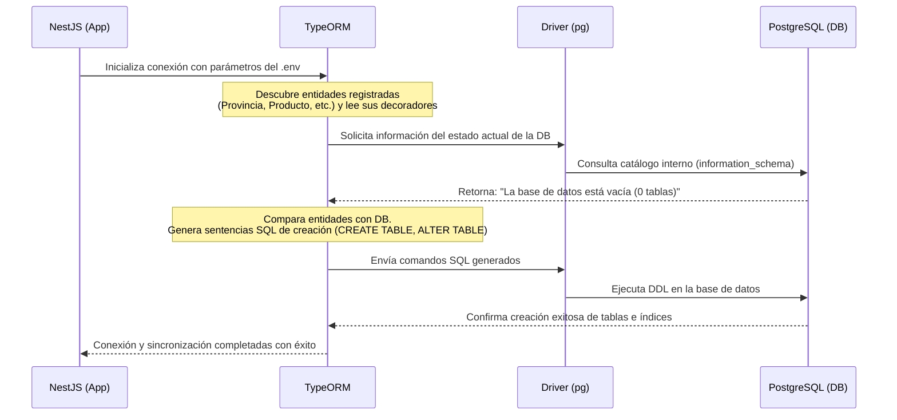

# Proceso de Creación Automática de Tablas en la Base de Datos

Cuando levantas el proyecto por primera vez con una base de datos vacía, las tablas y relaciones se generan automáticamente. Este documento detalla las **tecnologías involucradas** en este proceso y explica **cómo funciona paso a paso**.

---

## 1. Tecnologías Involucradas

### A. NestJS (Framework)
Es el framework sobre el cual está construida la aplicación. Se encarga de:
- Inicializar el ciclo de vida del proyecto.
- Cargar las variables de entorno del archivo `.env` mediante `@nestjs/config`.
- Levantar los módulos de la aplicación (como `AppModule` y `PastasModule`).

### B. TypeORM (Object-Relational Mapper)
Es la tecnología central en este proceso. TypeORM es un mapeador objeto-relacional que nos permite interactuar con la base de datos utilizando clases de TypeScript (Entidades) en lugar de escribir consultas SQL a mano. 
- Lee los decoradores (como `@Entity`, `@Column`, `@ManyToOne`) en nuestras clases de `src/pastas/entities/`.
- Compara las clases de TypeScript con el estado actual del esquema de la base de datos.
- Genera dinámicamente las sentencias SQL necesarias (`CREATE TABLE`, `ALTER TABLE`) para actualizar la base de datos.

### C. pg / node-postgres (Driver del Motor de Base de Datos)
Es la librería cliente que actúa como puente de bajo nivel entre NestJS/TypeORM y el servidor de PostgreSQL.
- Se conecta al socket TCP/IP de la base de datos.
- Envía los comandos de consulta y comandos SQL generados por TypeORM.
- Retorna los resultados (o errores) de la base de datos al backend.

### D. PostgreSQL (Motor de Base de Datos)
Es el sistema gestor de bases de datos relacionales (RDBMS) ejecutándose en Docker.
- Recibe las instrucciones SQL de creación de tablas.
- Ejecuta los comandos DDL (Data Definition Language).
- Crea físicamente las tablas, restricciones de clave foránea, índices y tipos de datos en el almacenamiento.

---

## 2. El Proceso de Creación Paso a Paso

El proceso ocurre de manera automática al ejecutar `docker compose up` y sigue el siguiente flujo de ejecución:

### Detalle de las etapas:

1. **Arranque e Inicialización**: NestJS arranca y lee el archivo [app.module.ts](file:///c:/Users/belet/OneDrive/Desktop/fabrica/src/app.module.ts). TypeORM se inicializa con la opción `synchronize: true`.
2. **Escaneo de Entidades (Metadata Discovery)**: TypeORM busca todas las clases decoradas con `@Entity()` registradas en [pastas.module.ts](file:///c:/Users/belet/OneDrive/Desktop/fabrica/src/pastas/pastas.module.ts). Traduce cada propiedad a su tipo de dato SQL correspondiente (ej: `nombre: string` con `@Column({ length: 200 })` se traduce a `VARCHAR(200)`).
3. **Inspección de la DB**: TypeORM consulta las tablas del sistema de PostgreSQL para inspeccionar el estado físico actual del esquema.
4. **Comparación e Inferencia**:
    - Si detecta que una tabla descrita en TypeScript no existe en la base de datos (como en una base de datos vacía), genera un query `CREATE TABLE`.
    - Si detecta relaciones (`@ManyToOne`), genera los queries `ALTER TABLE ... ADD CONSTRAINT ...` para crear las claves foráneas en el orden de dependencias correcto para que no fallen por integridad referencial.
5. **Ejecución y Confirmación**: El driver `pg` envía el lote de consultas a PostgreSQL, que las compila y crea el esquema. Una vez completado, TypeORM da paso para que NestJS termine de arrancar e inicie el servidor web en el puerto `8000`.
